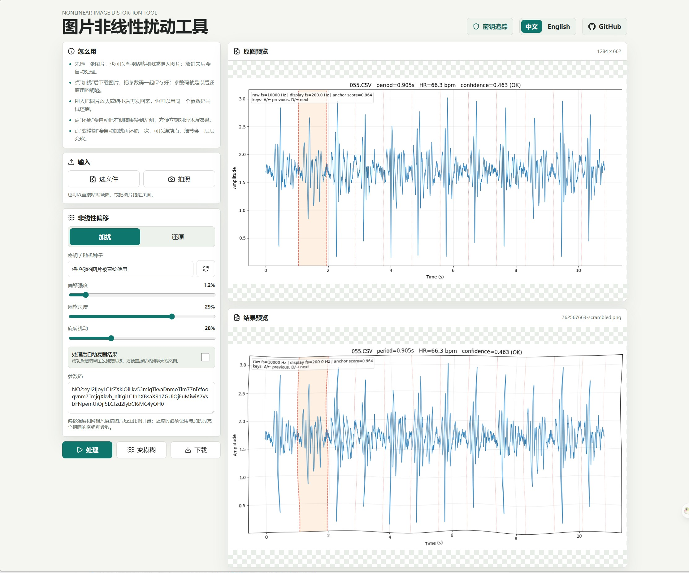

# 图片非线性扰动工具

[English](./README_EN.md)

一个在浏览器本地运行的图片非线性扰动工具。它可以把图纸、截图、资料图做成带参数的非线性扰动版本，也可以用同一个参数码尝试还原，方便做简单脱敏和来源确认。



## 它能做什么

- **加扰图片**：用密钥把图片做非线性变形，直接下载处理后的 PNG。
- **用参数码还原**：保存 `NO2:` 开头的参数码，之后用同一个参数码尝试还原。
- **抗等比例缩放**：图片被放大或缩小后，再放进工具里仍然可以用同一参数码尝试还原。
- **粘贴自动处理**：复制截图后直接粘贴到页面，工具会自动按当前模式处理。
- **拖拽和拍照**：支持选择文件、手机拍照、拖拽图片进页面。
- **连续变模糊**：点“变模糊”会自动加扰再还原一次，可以连续点，让细节逐步变软。
- **自动复制结果**：可以打开“处理后自动复制结果”，处理完成后直接把结果图放到剪贴板。
- **记住上次设置**：页面会自动保存当前密钥和参数，下次打开继续使用。

## 基本用法

1. 打开页面后，选择图片、拍照、拖拽图片，或者直接粘贴截图。
2. 选择“加扰”或“还原”模式。
3. 调整密钥、偏移强度、网格尺度和旋转扰动。
4. 保存参数码。以后还原时，粘贴这个参数码即可恢复同一组参数。
5. 点“处理”生成结果，确认后下载。

## 参数码很重要

参数码就是这张图的“钥匙”。如果要之后还原或证明来源，请同时保存：

- 处理后的图片
- `NO2:` 开头的参数码

只记住密钥不够，偏移强度、网格尺度、旋转扰动也必须一致。

## 运行

```bash
npm install
npm run dev -- --host 127.0.0.1 --port 5288
```

构建生产版本：

```bash
npm run build
```

## 注意

还原不是逐像素无损恢复。图片经过加扰、缩放、压缩、截图后，都会有一些损失。这个工具的目标是：用正确参数码能明显更好地还原，用错误参数很难还原出相同效果。
