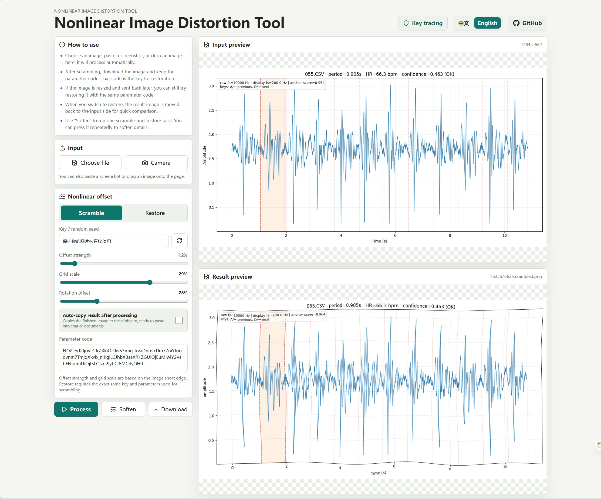

# Nonlinear Image Distortion Tool

[中文](./README.md)

A local browser tool for nonlinear image distortion. It turns drawings, screenshots, and reference images into parameter-based nonlinear distorted versions, and can use the same parameter code for approximate restoration, simple privacy masking, and source checks.



## What It Does

- **Scramble images**: apply a deterministic nonlinear distortion with your key, then download the PNG result.
- **Restore with a parameter code**: save the `NO2:` parameter code and use it later to restore with the same settings.
- **Handles proportional scaling**: if the image is resized, the same parameter code can still be used for approximate restoration.
- **Paste-to-process**: paste a screenshot directly into the page and it will process automatically with the current mode.
- **File, camera, and drag-and-drop input**: choose a file, take a photo, or drag an image into the page.
- **Repeated softening**: click “Blur” repeatedly to scramble and restore again, softening details step by step.
- **Copy result automatically**: optionally copy the processed PNG to the clipboard after processing.
- **Remembers settings**: the page saves your latest key and parameters locally.

## Basic Workflow

1. Open the page and choose a file, take a photo, drag an image in, or paste a screenshot.
2. Select Scramble or Restore.
3. Adjust the key, offset strength, grid size, and swirl.
4. Save the parameter code. Paste it later to restore the same settings.
5. Click Process, review the result, then download it.

## Keep the Parameter Code

The parameter code is the key to reproducing the result. If you need to restore the image later or identify a source, keep both:

- the processed image
- the `NO2:` parameter code

The key alone is not enough. Offset strength, grid size, and swirl must also match.

## Run Locally

```bash
npm install
npm run dev -- --host 127.0.0.1 --port 5288
```

Build for production:

```bash
npm run build
```

## Note

Restoration is approximate, not pixel-perfect. Scrambling, resizing, compression, and screenshots all introduce some loss. The goal is that the correct parameter code restores the image noticeably better than a wrong one.
